# Setup your working environment
## Your Hands-On Workshop environment
### Introduction
In this SAP TechEd 2025 Hands-on Workshop __Unlocking AI-driven insights from your business data in SAP HANA Cloud__ (DA261), the exercises are to be pursued either in SAP HANA Cloud Database Explorer , or a Business Application Studio python environment.
<br><br>
You will work with the following technical environment
- a centrally provided SAP HANA Cloud system 
  - with your personal user-id and schema, with full access to the objects in their own schema
  - shared data provided within a separate, read-only, schema __DA261_SHARE__
- a SQL console and database tools within a provided SAP HANA Cloud Database Explorer instance (referred to as DBX),
  - The SAP HANA Cloud database explorer is a web-based tool for browsing and working with SAP HANA database objects such as tables, views, functions, stored procedures. In addition, DBX can be used to import and export data, execute SQL statements, create remote sources, work with multi-model data such as graph, spatial and JSON collections, view trace files, and any other SQL activity.
- and a Python Jupyter Notebook environment within a provided SAP Business Application Studio instance (referred to as BAS)
  - SAP Business Application Studio (BAS) is a cloud-based professional developer tool for building applications and extending SAP solutions.

The data  
- blabla ... These tables contain some generic transactional sales data including details of customers, products, employees as well as review and location data. 

<br><br>

## Access to SAP HANA Cloud Database Explorer and SQL console


### Logging into Database Explorer (DBX)
<li>Open the SAP HANA Database Explorer URL  

Database Explorer [link](https://hana-cockpit-004.cfapps.eu10.hana.ondemand.com/hrtt/sap/hana/cst/catalog/cockpit-index.html?databaseid=C3683523)  
(https://hana-cockpit-004.cfapps.eu10.hana.ondemand.com/hrtt/sap/hana/cst/catalog/cockpit-index.html?databaseid=C3683523)

<li> Select Sign in to another account

<br>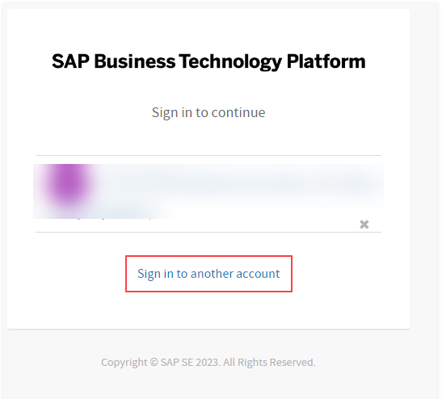


- _Type_ __academy-platform__ as the IDP and then select __"Sign in with alternative identity provider"__.

<br>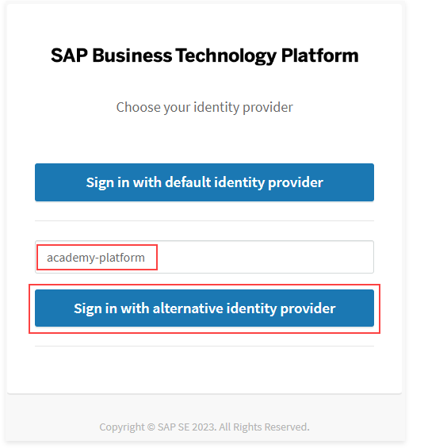


__Note__: If the following Application Authorization screen appears, select __AUTHORIZE__ to continue.

<br>


- Enter the UserId and password provided the workshop speaker and according to your desk-id
  - User ID: \<as provided, example AC######U##\>
  - Password: \<as provided\>

-  Then select __Continue__.
<br>

- Once logged into DBX, the application will prompt you to enter credentials for logging in to SAP HANA Cloud  instance. Use the same credentials for the database connection as in the earlier step.
<br>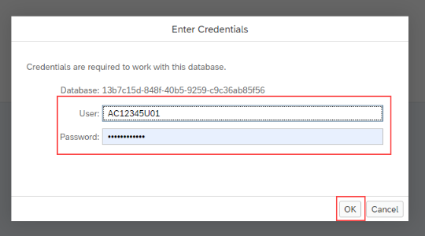

- Now, the SAP HANA Database Explorer is ready to be used:
<br>

- Execute the following SQL query
```sql
select * from dummy

```

- After successfully logging in to the SAP HANA Cloud Database Explorer, the next step is to copy the data for the exercises.
```sql 
?? Copy tables command
```
<br><br><br>

## Configuring your Python environment in SAP Business Application Studio

### Machine Learning model development to application integration workflow
1. Data for ML model development is accessed from Python Jupyter Notebook envrionment in SAP HANA Cloud 
2. Python machine learning client package (hana-ml) is used for ML model experiments and development
3. SQL-script HANA deployment infrastructure (HDI) and CAP design-time artifacts are generated from hana-ml and integrated into the BAS application project

***

### Configuring the Jupyter Notebook extension in SAP Business Application Studio

#### Creating the BAS DEV Space
This exercise uses the Jupyter Notebooks extension in SAP Business Application Studio (BAS). This enables the use of python coding to leverage large language models in addition to the SAP HANA Cloud vector engine.

1. Select to open Business Application Studio to get started.<br>
   BAS [link](https://sap-build-hana-cloud.eu10cf.applicationstudio.cloud.sap/index.html)
   link text https://sap-build-hana-cloud.eu10cf.applicationstudio.cloud.sap/index.html

2. Enter the same UserId and password provided by the workshop speaker before and according to your desk-id
     - User ID: \<as provided, example AC######U##\>
     - Password: \<as provided\>

3. In the landing page for BAS, click on Create Dev Space to create a virtual environment in which to start a project.

4. For the Dev Space name, use AC207556U10_VectorDB and select SAP HANA Native Application as the application type. On the right hand side, under the list of Additional SAP Extensions, choose Python Tools and then select Create Dev Space to start the process. This will create a dedicated development environment with all the tools required to run the notebook.
<br>

1. It will take a few minutes for the Dev Space to start up. The status can be seen beside the name.
<br>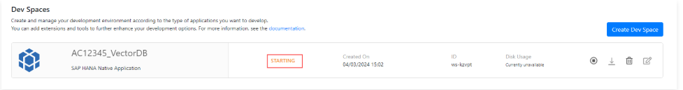

1. Once the status changes to Running, select the name (AC207556U10_VectorDB) to open it.
<br>


#### Cloning the DA261 repository project
The following steps are to setup the required notebook.

1 On the Get Started page in Business Application Studio, select the option Clone from Git to import a repository from Github.
<br>

2. A prompt will appear on top asking for a URL to the repository. Copy and paste in the following URL and then press Enter.
> https://github.com/SAP-samples/sap-genai-hub-with-sap-hana-cloud-vector-engine.git>
<br>

3 The following message will appear. Select Open to see the imported files in the Explorer window.
<br>

4. The files should now be visible in the Explorer pane on the left hand side. 
<br>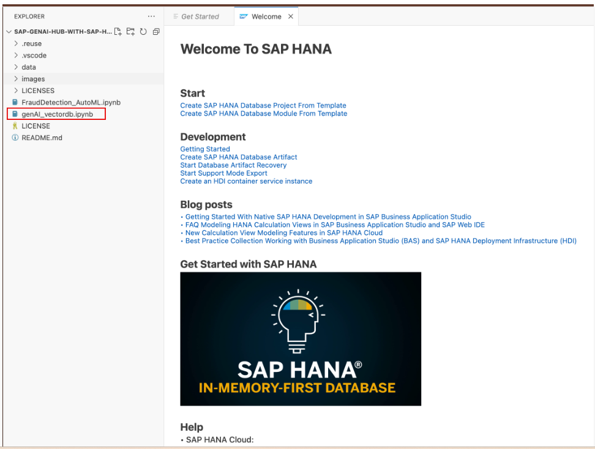

#### Configure the python runtime
- Select the Jupyter Notebook genAI_vectordb.ipynb to open it.
<br>
> Note: If the following message appears, select Save as plain text on the dev space for future use.
<br>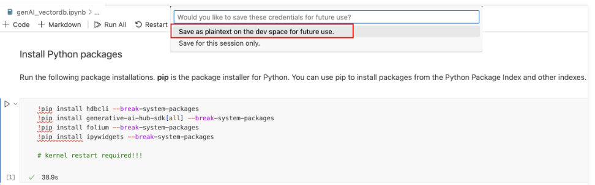

5. Open a new terminal in BAS by following the numbered sequence of steps.
<br>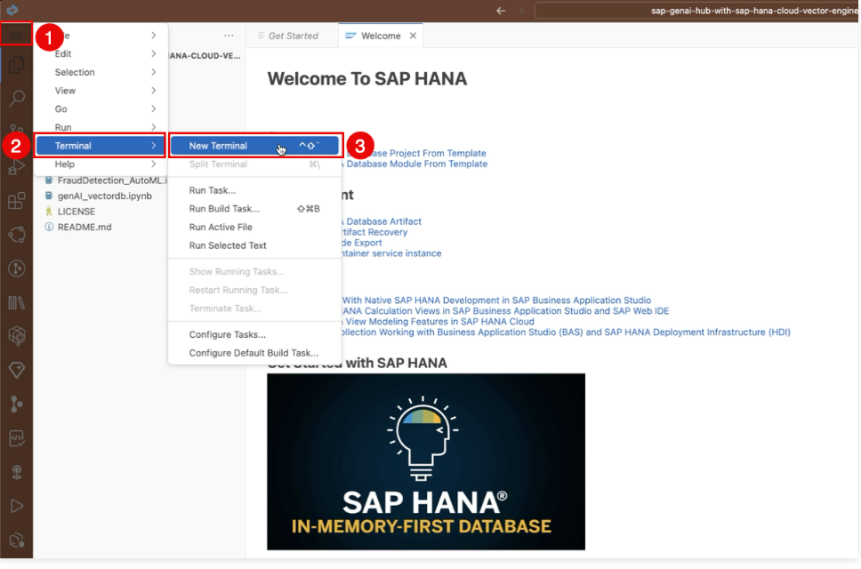

6. Change to the bin folder where ... is located.

To change folder use the following shell command as seen below:

> cd bin
<br>


### Configure Jupyter and Python Extensions

1. The notebook, with executable code cells, will be displayed on the screen.
   <br>

> In the next section the python environment will be configured so that the code cells can be executed from within the Jupyter notebook.

2 Run the first code cell to install the required python modules.

> Note: To execute a code cell, click on the play icon beside the cell. It is also possible to execute it by clicking into the code cell and pressing Shift+Enter.
   <br>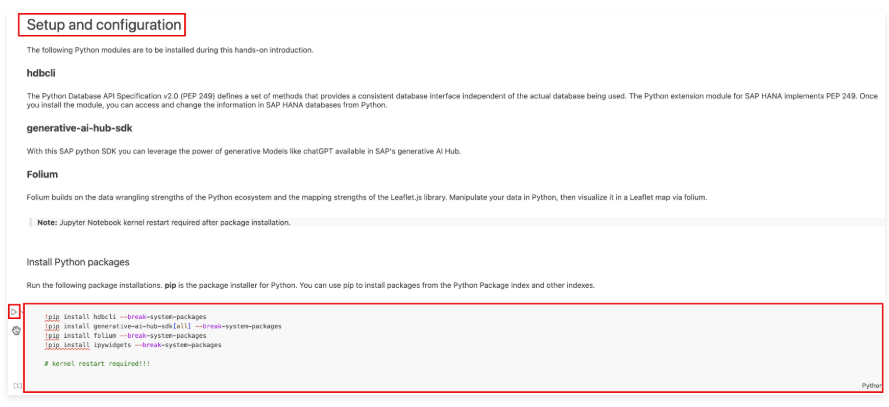

3 When the first cell is executed, a prompt asking to choose a kernel source will appear. Select Python Environments.
   <br>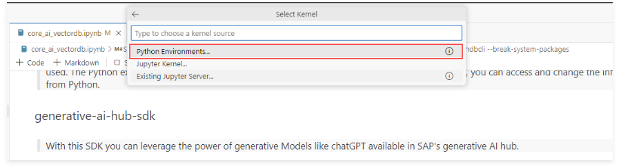

4 On the next screen, select the recommended Python kernel (3.11.2).
   <br>

5. The required libraries will now start installing, and some messages about port numbers will also be visible in the lower right corner. This could take a few minutes to complete also.
   <br>

6 Once the libraries have been successfully installed, the kernel must be restarted. Do this by clicking on the Restart option in the menu bar at the top.
   <br>

7 On the following pop-up message box, click on Restart again to complete the process.
   <br>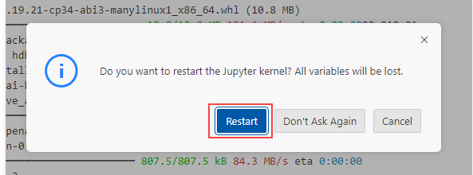

> Note: It will take a few seconds for the kernel to restart and once done, the environment is ready for use!

8 Please follow the instructions in the Jupyter Notebook in BAS to continue with the rest of the lesson.

> Note: For the section on connecting to the SAP HANA Cloud instance with the vector engine, please use the following as the HANA hostname:
13b7c15d-848f-40b5-9259-c9c36ab85f56.hna1.prod-eu10.hanacloud.ondemand.com
  <br>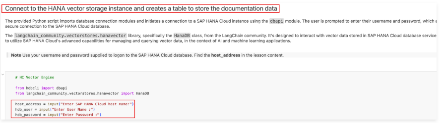


<br><br><br>

# Next unit
## SAP Business Technology Platform - Generative AI Hub with Vector grounding


<br><br><br>

# Appendix MISC stuff
## Introduction to SAP HANA Cloud/Generative AI Hub with Vector grounding

### SQL approach

> Note: SAP HANA Cloud vector engine native SQL can also be used in a RAG scenario using the L2DISTANCE and COSINE_SIMILARITY functions. For more on this please register for a free SAP HANA Cloud Basic Trial.

<li> ...
<br><br>

### Hands-on Retrieval Augmented Generation (RAG) workflow
1. Documents to be included in vector analysis are fed into the model.
2. The contents of the files are split into smaller chunks.
3. Embedding functions are used to create embeddings from the file/document chunks.
4. The embeddings are then stored as vectors in the SAP HANA Cloud Database.
5. When a query or prompt is submitted, the query itself is then embedded into vector form.
6. The query vector is compared to the values stored as vectors in SAP HANA Cloud via a similarity/semantic search.
7. The most appropriate results are forwarded, along with the original query, to a large language model such as Chat GPT.
8. The LLM uses the results of the HANA vector search to augment its own searching capabilities, and the final answer is returned to the user.

## Create Cloud Foundry SAP AI Core service key

The Welcome to SAP HANA page will appear. Follow the below sequence to log in to Cloud Foundry:
Select the Cloud Foundry icon
Expand Services folder and select the login icon.

The Cloud Foundry Sign In panel will appear. Overwrite the Cloud Foundry Endpoint with the following value, and then choose SSO as the authentication method:

Login Option Selection
Cloud Foundry Endpoint <https://api.cf.eu10-004.hana.ondemand.com>
Authentication method SSO Passcode

Select the Open a new browser page to generate your SSO passcode.

Enter academy-platform as the identity provider and then select the Sign in with alternative provider option.

Copy the generated passcode to the clipboard.

Paste the copied passcode in the Enter your SSO passcode field.

Note: If prompted for clipboard permissions by your browser, select Allow.

Sign into the Cloud Foundry Target by clicking the Sign In button.

Proceed by selecting the desired Cloud Foundry Target and Space as seen below.

Cloud Foundry Target Selection
Cloud Foundry Organization TRIAL - Shared_sap-core-ai-eu10
Space dev
Select Apply

Observe all the services associated with the target:

## Create SAP GenAI Core service key

## misc
Change to the bin folder where the cf_create_bas_sso.py script is located.

To change folder use the following shell command as seen below:

> cd bin
<br>

### optional 
7. Create the SAP AI Core service key by executing the following command from the bin folder.

> #python3 cf_create_bas_sso.py --service "default_aicore" --service_key AC207556U10_key

The script will indicate if the creation was successful or not.

Note: This service key will be deleted once the workshop registration expires.

Once the key has been successfully created, the terminal window can be closed. Select the ‘X’ button to close it and return to the jupyter notebook.

### optional 
7. Create the SAP AI Core service key by executing the following command from the bin folder.

> #python3 cf_create_bas_sso.py --service "default_aicore" --service_key AC207556U10_key

The script will indicate if the creation was successful or not.

Note: This service key will be deleted once the workshop registration expires.

Once the key has been successfully created, the terminal window can be closed. Select the ‘X’ button to close it and return to the jupyter notebook.