# Prepare your SAP HANA Cloud and Python environment in SAP Business Application Studio


## Preparing your working environment overview

In this SAP TechEd 2025 Hands-on Workshop __Unlocking AI-driven insights from your business data in SAP HANA Cloud__ (DA261), the exercises are to be pursued either using __SAP HANA Cloud Database Explorer__ , or using a __Business Application Studio Python environment__.
<br><br>
### You will work with the following technical environment
- a centrally provided __SAP HANA Cloud database system__ 
  - with your personal user-id and schema, with full access to the objects in your database user schema
  - shared data provided within a separate, read-only, schema __DA261_SHARE__
- a __SQL console__ and database tools within a provided __SAP HANA Cloud Database Explorer__ instance (referred to as __DBX__),
  - _The SAP HANA Cloud database explorer is a web-based tool for browsing and working with SAP HANA database objects such as tables, views, functions, stored procedures. In addition, DBX can be used to import and export data, execute SQL statements, create remote sources, work with multi-model data such as graph, spatial and JSON collections, view trace files, and any other SQL activity._
- and a __Python Jupyter Notebook environment__ within a provided __SAP Business Application Studio__ instance (referred to as __BAS__)
  - _SAP Business Application Studio (BAS) is a cloud-based professional developer tool for building applications and extending SAP solutions._

The technical requirements to complete the exercises in this repository, including hardware and software specifications are taken care of by the provided systems used for the in-person Hands-on Workshop. Required _configuration tasks_ are outlined in the following [Getting Started instructions](exercises/ex0/) section below.

### Setup instruction in your "private" environment
- Setup requirement instructions for pursuing this Hands-on Workshop in your local or trial / free-tier environment are documented in the [private setup prerequisites README](exercises/ex0/README_private_setup.md). 
- Note, it is not intended run pursue this exercise in your private environment during the hands-on session, the instructions intend is rather to you repeat or continue to pursue the session content after the TechEd 2025 event.

<br>

## Step 1 - Getting started with SAP HANA Cloud Database Explorer and SQL console

### Logging into Database Explorer (DBX)
- __Open__ the SAP HANA Database Explorer __URL__  
   - SAP TechEd Berlin DBX: [https://hana-cockpit-004.cfapps.eu10.hana.ondemand.com/hrtt/sap/hana/cst/catalog/cockpit-index.html?databaseid=C3683523](https://hana-cockpit-004.cfapps.eu10.hana.ondemand.com/hrtt/sap/hana/cst/catalog/cockpit-index.html?databaseid=C3683523)
  - ASUG Tech Connect Louisville DBX [https://hana-cloud-academy-us10.hana-tooling.ingress.orchestration.prod-us10.hanacloud.ondemand.com/hrtt/sap/hana/cst/catalog/cockpit-index.html?databaseid=C305434](https://hana-cloud-academy-us10.hana-tooling.ingress.orchestration.prod-us10.hanacloud.ondemand.com/hrtt/sap/hana/cst/catalog/cockpit-index.html?databaseid=C305434)
  - SAP TechEd on Tour Bangalore [DBX-link]

- Select __Sign in to another account__
<br>  

<br>

- In the __Choose your identity provider__ step
  -  _Type_ __academy-platform__ as the IDP and 
  -  then select __"Sign in with alternative identity provider"__.
<br>  

<br>

- __Note__: If the following Application Authorization screen appears, select __AUTHORIZE__ to continue.
<br>  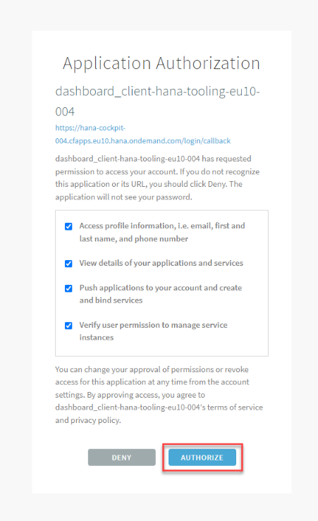

<br>

- In the next __Sign In__ step, __enter__ the __UserId__ and __password__ provided to you by the workshop instructor and __according to your desk-id__
  - User ID: \<as provided, example __AC######U##__\>
  - Password: \<as provided\> 
  - Then select __Continue__.
<br> 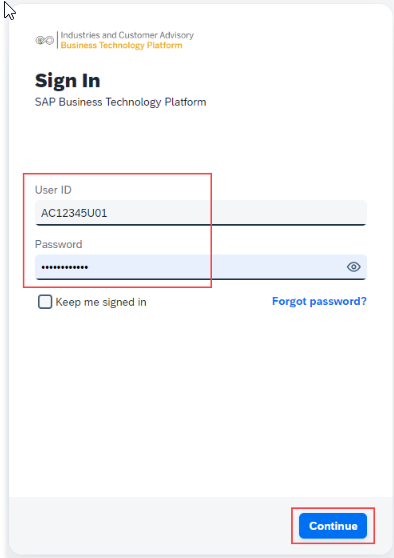

<br>

Now, once the login to SAP HANA Database Explorer application was successful
-  the application will __prompt__ you __again to enter credentials__ for logging in to the __database instance__. 
-  __Re-use__ the __same credentials__ for the database connection as you used in the previous step.
<br>

- __Now, the SAP HANA Database Explorer is ready to be used__:
<br>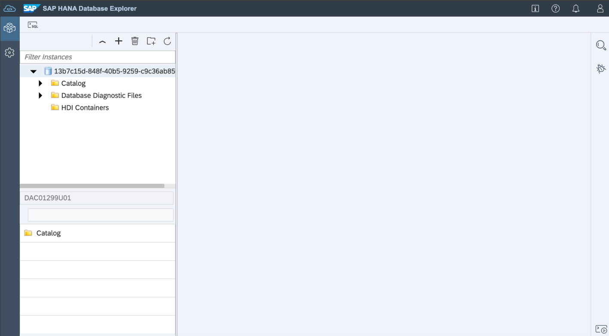


<br>

- Open a SQL editor
<br>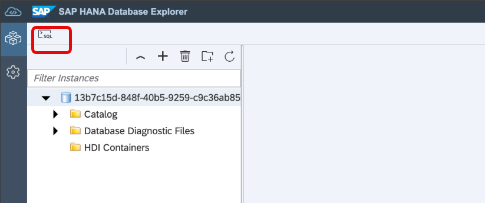

<br>

- Execute the following SQL query
   ```sql
   select * from dummy;

   ```
   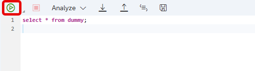


<br><br><br>

## Step 2 - Configuring your Python environment in SAP Business Application Studio

### Understanding the handshake between the Machine Learning model development and the application development workflow
1. The Python environment in SAP Business Application Studio is used for ML model development, data for ML model development is accessed in Python Jupyter Notebook envrionment from SAP HANA Cloud 
2. The used Python machine learning client package (hana-ml) is used for ML model experiments and development
3. The hana-ml Python package provides methods for dedicated design-time artifact generation for targeted algorithm and the use case explored, artifcats generated include SQL-script HANA deployment infrastructure (HDI)- and CAP design-time artifacts. 
4. The handshake step is now, once the ML experimentation and model development is completed, to generate the design-time artifacts based on final algorihtm choice and configurations. The Application developer can include those artifacts directly into an development project in SAP Business Application Studio.
   
***

### 2.1 Creating the SAP Business Application Studio DEV Space
This exercise uses the Jupyter Notebooks extension in SAP Business Application Studio (BAS). This enables the use of python coding to leverage the hana-ml and other packages, to script in Python like with any other Machine Learning python package, but experiment and execute in SAP HANA Cloud.

1. Select to open Business Application Studio (BAS) to get started.<br>
   - SAP TechEd Berlin BAS: [https://sap-build-hana-cloud.eu10cf.applicationstudio.cloud.sap/index.html](https://sap-build-hana-cloud.eu10cf.applicationstudio.cloud.sap/index.html)
   - ASUG Tech Connect Louisville BAS: [https://hana-cloud-academy-us10.us10cf.applicationstudio.cloud.sap/index.html](https://hana-cloud-academy-us10.us10cf.applicationstudio.cloud.sap/index.html)
   - SAP TechEd on Tour Bangalore [DBX-link]

2. Enter the same UserId and password provided by the workshop speaker before and according to your desk-id
     - User ID: \<as provided, example AC######U##\>
     - Password: \<as provided\>

3. In the landing page for BAS, click on Create Dev Space to create a virtual environment in which to start a project.

4. Choose the following for creating your dev space, 
      - __Dev space name__ (replace ## with index of your assgined user id):
        - SAP TechEd Berlin __DA261_AC207556U##__ 
        - ASUG Tech Connect Louisville __DA261_AC232022U##__
      - select for __application type__ on the left __SAP HANA Native Application__  
      - select from __Additional SAP Extensions__ on the right hand side the __Python Tools__
      - and then select __Create Dev Space__ to start the process. This will create a dedicated development environment with all the tools required to run the Python Jupyter Notebooks.
<br>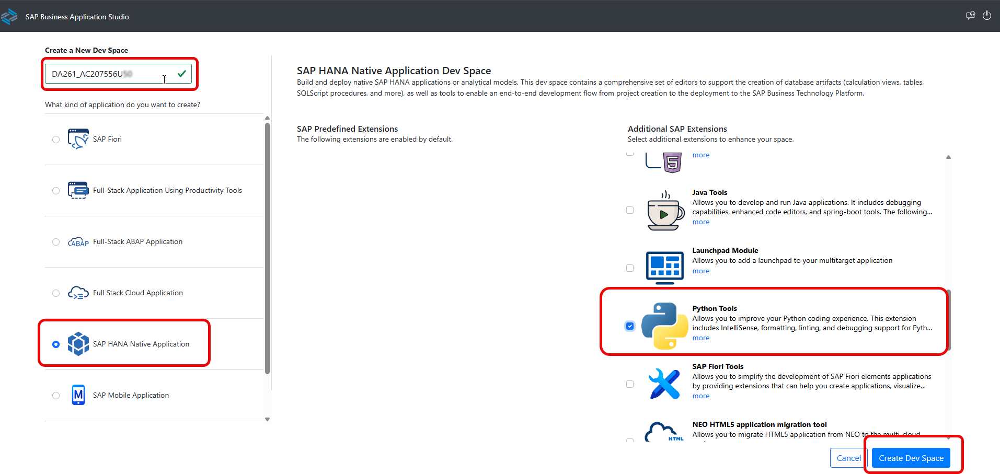

1. It will take a few minutes for the Dev Space to start up. The status can be seen beside the name.
<br>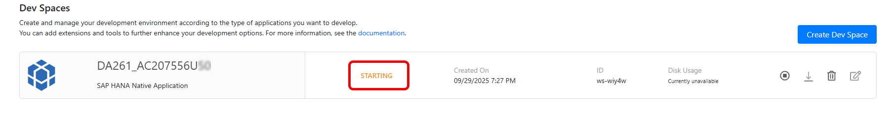

1. Once the status changes to __Running__, __click on your dev space name__ (__DA261_AC207556U##__) to open it.
<br>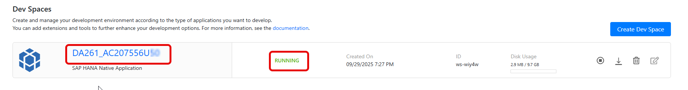

<br><br>

### 2.2 Cloning the DA261 repository project
The following steps complete the configuration of the Jupyter Notebook- and Python environment in SAP Business Application Studio.

1.  On the Get Started page in Business Application Studio, select the option Clone from Git to import a repository from Github.
<br>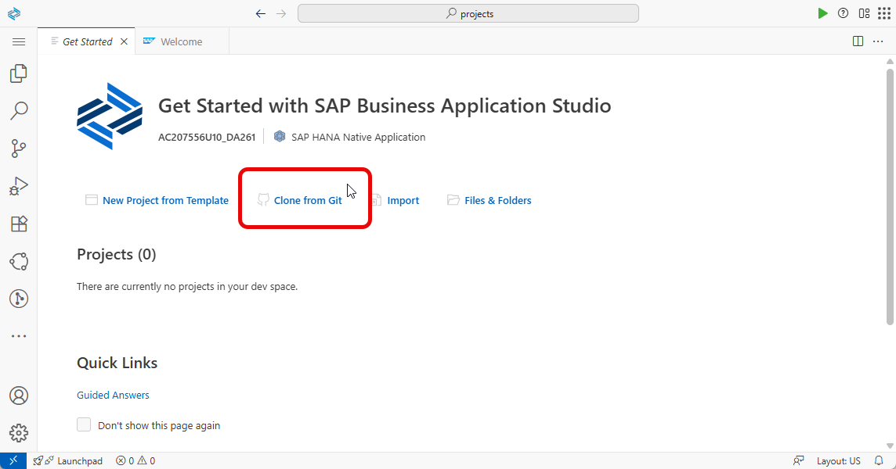

<br>

2. A prompt will appear on top asking for a URL to the repository. Copy and paste in the following URL and then press Enter.
   - https://github.com/SAP-samples/teched2025-DA261.git
<br>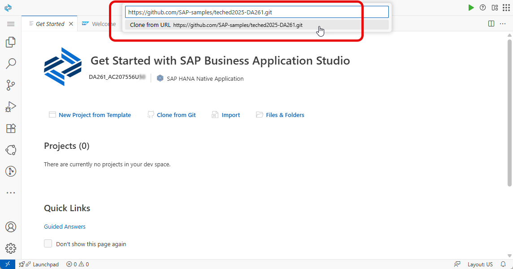

<br>

3. The following message will appear. Select Open to see the imported files in the Explorer window.
<br>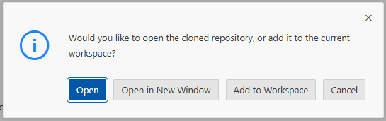

4. The files should now be visible in the Explorer pane on the left hand side. 
<br>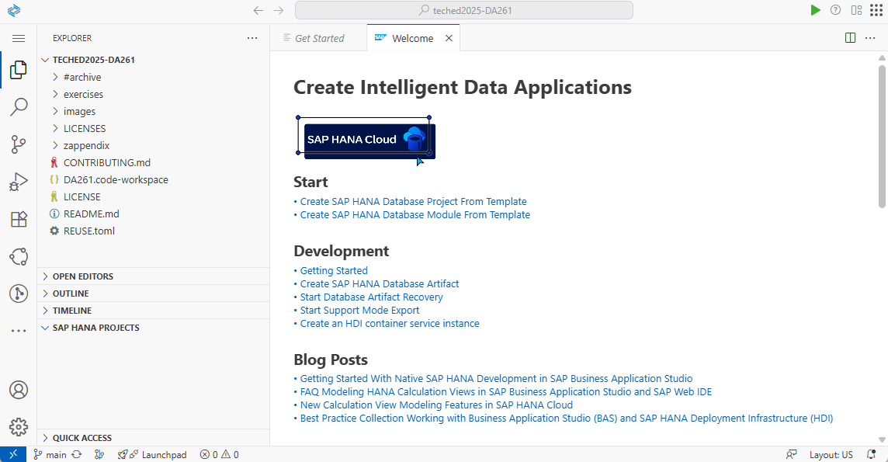

<br><br>

### 2.3 Configure the python runtime
The prepared python runtime and tools, as part of the Business Application Studio dev-space, require some additional refinement regarding python package installation and connection to the SAP HANA Cloud database from Python.  

Pursue the following steps
1. Select the Jupyter Notebook __/exercises/ex0/ex0_1_python_setup.ipynb__ to __open__ it from the project explorer tree.
<br>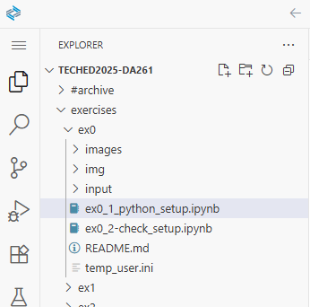  

2. The notebook, with executable python code cells, will be displayed on the screen.
   <br>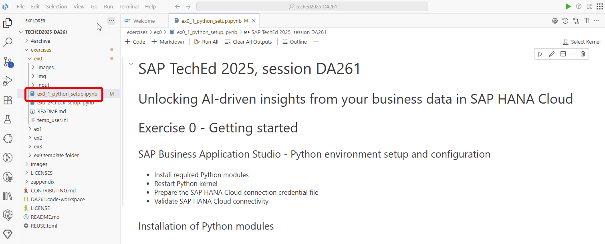

3. Scroll down to the notebook script cell with the __!pip install ... commands__ 
   - Run the code cell to install the required python modules.
   - Note, in order to __execute a code cell__, __click__ on the __play icon__ beside to the cell on the left.  
   It is also possible to execute it by clicking into the code cell and pressing Shift+Enter.
   <br>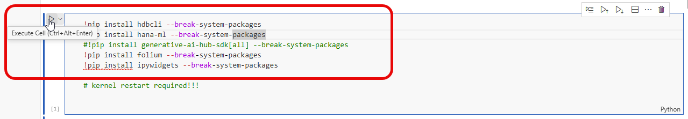


4. When the first cell is triggered to be executed, you will be __prompted__ asking to __choose a python kernel__ 
   - Select __Python Environments....__
   <br>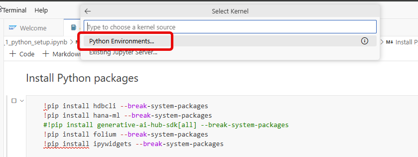

5. On the next prompt window
   - select the recommended kernel __Python (3.13.1)__
   <br>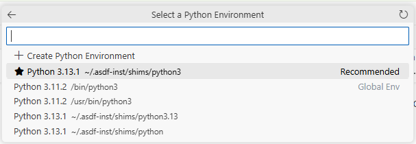

6. The __required libraries__ will now __start installing__
   - This could take about ~30 seconds to a 1 minute to complete
   - Some messages about port numbers will also be visible in the lower right corner, which can be ignored and closed. 
   <br>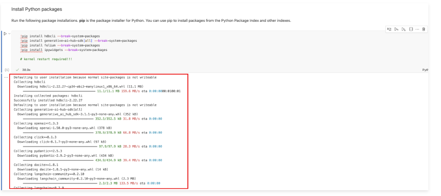

7. Once the libraries have been successfully installed, the __kernel must be restarted__. 
   - Do this by __clicking__ on the __Restart__-icon in the menu bar at the top.
   <br>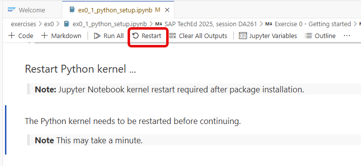

8. In the following pop-up prompt window
   - __click__ on __Restart__ again to confirm and complete the process.
   - note, it will take a few seconds for the kernel to restart
   <br>

<br>

__Once the kernel is restarted, the environment is ready for use!__

<br><br>

### 2.4 Prepare the HANA Cloud database connection properties
For our convenience, we will prepare the database connection credentials within a *.ini-file, which we can easily consume from the Python notebooks and avoid repeated crendential prompting.

Pursue the following steps

1. Create a copy of the [./ex0/temp_user.ini](ex0/temp_user.ini) file in the same folder and rename it to [./ex0/user.ini](ex0/user.ini) 
   - copy the file
<br>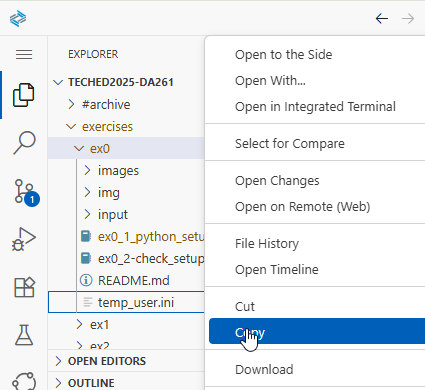
   - paste the file
<br>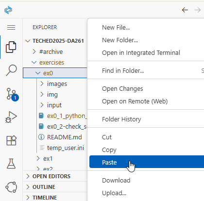
   - rename the file
<br>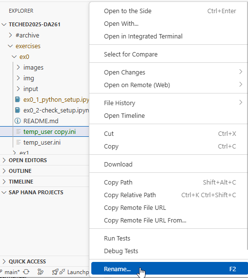
   - rename as user.ini
<br>

<br> 

2. Edit and enter the __user__ and the __password__ given to you by the instructor in __user.ini__-file 
   - save the file
<br>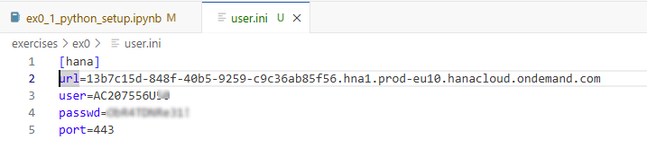

3. Next execute the following python code cells to test the SAP HANA Cloud database connection
<br>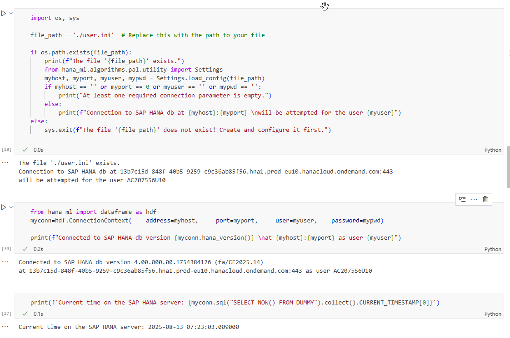

You should have successfully connect to the SAP HANA Cloud instance with hostname:  
   - SAP TechEd Berlin __13b7c15d-848f-40b5-9259-c9c36ab85f56.hna1.prod-eu10.hanacloud.ondemand.com__
   - ASUG Tech Connect Louisville __085fe51f-540c-4b27-8523-3ff931c0674d.hana.prod-us10.hanacloud.ondemand.com__
   - SAP TechEd on Tour Bangalore 

<br>

### 2.5 Using the connection setup in the exercises
> Note: the notebook file __ex0_2-check_setup.ipynb__ will be used throughout exercise 1 and 2, no change to the file is required.

<br><br>

## Summary
Now that you have successfully prepared your Python environment in SAP Business Application Studio and have connected successfully to the SAP HANA Cloud instance,  
> continue to - [Exercise 1 - Exercise 1 Description](../ex1/README.md)
